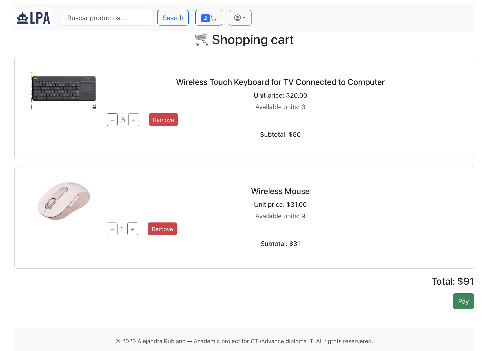
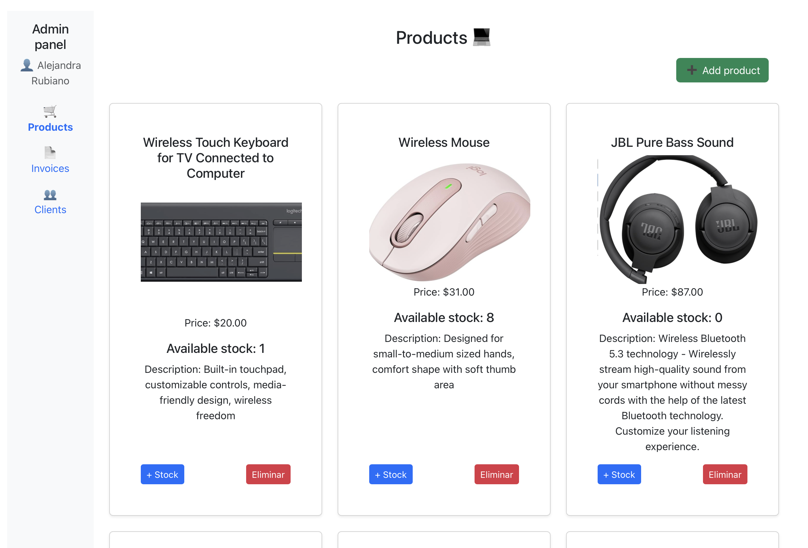
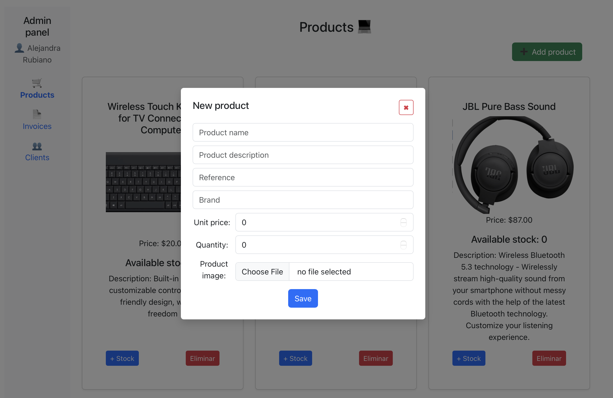

# Tech Products E-commerce (MVP)

Minimum Viable Product (MVP) of an e-commerce platform for selling technology products such as mice, keyboards, headphones, monitors and computers.

The system includes both a customer-facing storefront and an administrative module that allows store managers to manage products, monitor users, and handle basic billing operations.

This project was developed as a prototype to demonstrate the architecture and core functionalities of a modern full-stack e-commerce system.

---

## Technologies

Frontend
- Vue.js
- JavaScript
- HTML / CSS

Backend
- Node.js
- Express.js

Database
- MySQL

---

## Main Features

Customer Side
- Product catalog
- Product details
- Basic e-commerce browsing experience

Administrative Module
- Add new products
- Update product information
- Manage product inventory
- View registered users
- Basic billing and order management

---

## System Purpose

The goal of this project is to demonstrate the implementation of a full-stack web application for an online store.  
The platform centralizes product management and simplifies administrative tasks such as inventory updates and product publishing.

This MVP focuses on the core functionalities required to operate a basic e-commerce platform.

---

## Project Architecture

The project follows a typical client-server architecture:

Frontend
- Vue.js application responsible for the user interface and user interactions.

Backend
- Node.js REST API responsible for business logic, product management, and data handling.

Database
- MySQL database used to store products, users and order information.

---

## Installation

### 1. Clone the repository

### 2. Install backend dependencies

### 4. Install frontend dependencies

### 5. Run frontend application

## Screenshots
## Screenshots

### Home Page

### Shopping Cart

### Admin Panel

### Add Product

---

## Author

Alejandra Rubiano  
Software Developer
